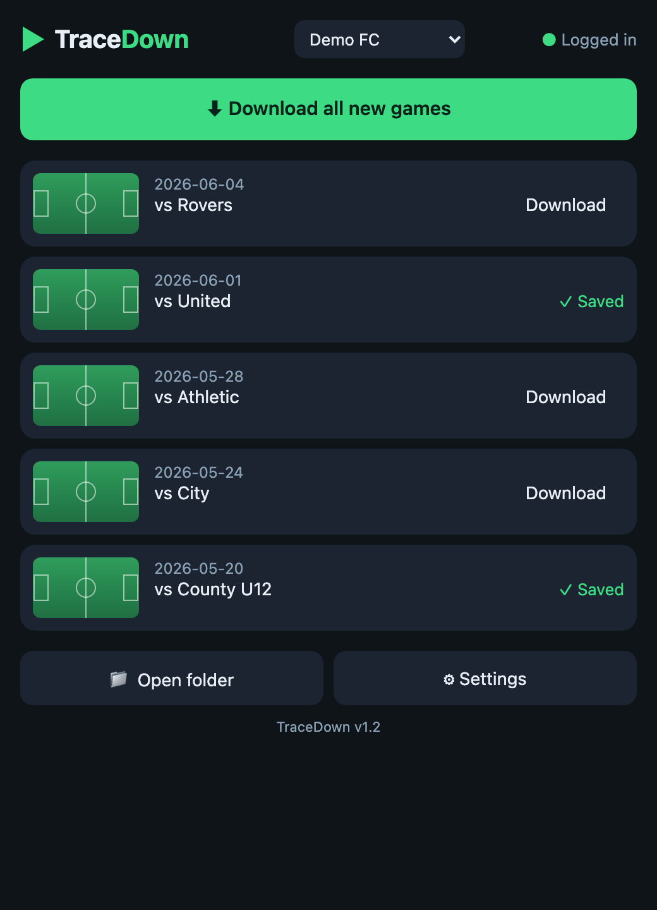

# TraceDown

A personal-use desktop app that downloads your own Trace game videos as 1080p MP4 files, directly to your Mac or Windows PC. You supply your own Trace subscription login — no third-party accounts, no cloud storage.

<p align="center">
  
</p>

> Unofficial tool, not affiliated with or endorsed by Trace. For use with your own footage and your own Trace subscription.
> *(Screenshot uses demo data.)*

---

## Download

Go to the [**Releases**](../../releases/latest) page and download the zip for your platform:

- `TraceDown-macOS.zip` — Mac (Apple Silicon + Intel)
- `TraceDown-Windows.zip` — Windows (x64)

---

## Install

### macOS

1. Unzip `TraceDown-macOS.zip`.
2. Drag **TraceDown** into your **Applications** folder.
3. First open: right-click the app → **Open** → click **Open** on the warning dialog (one-time unsigned-app prompt).

### Windows

1. Unzip `TraceDown-Windows.zip`.
2. Double-click `TraceDown.exe`.
3. If Windows SmartScreen appears, click **More info → Run anyway** (one-time prompt for unsigned apps).

---

## First Launch

On first launch the app downloads the video engine (~170 MB, one time). Once that completes:

1. Click **+ Add account**.
2. Log in with your Trace email address and the phone verification code.
3. Your games appear in the list.

---

## Usage

- Click a game to download both halves (1080p MP4) to your chosen output folder.
- Turn on **Auto-download** in Settings to automatically check for and download new games every 3 hours.

---

## Maintainer / Cutting a Release

Before tagging, regenerate icons if the icon source changed:

```bash
python assets/make_icon.py
```

To publish a new release, tag and push — GitHub Actions builds both installers and attaches them to the Release automatically:

```bash
git tag v1.x
git push origin v1.x
```

The Actions workflow (`.github/workflows/build.yml`) runs a matrix build on `macos-latest` and `windows-latest`, produces `TraceDown-macOS.zip` and `TraceDown-Windows.zip`, and attaches both to the GitHub Release.
